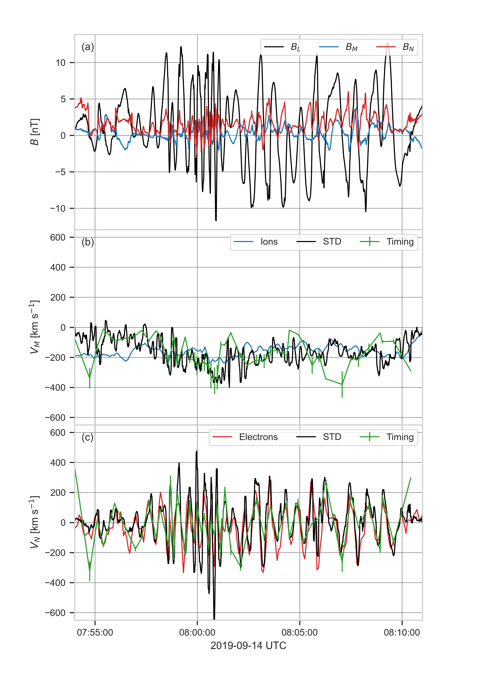
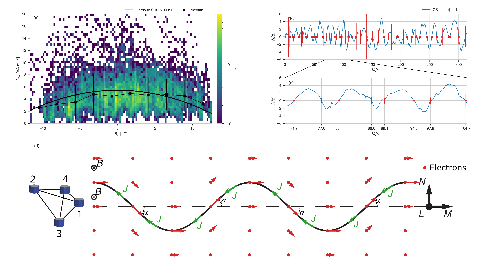

# Current Sheet Width


## Organisation
- [`cs-velocity.py`](./cs-velocity.py) contains the code to load data, compute the
 compute the velocity of the structure using MDD ([Shi et al. 2006](https://agupubs.onlinelibrary.wiley.com/doi/10.1029/2005GL025073)) and reproduce the Figure 3. The data rates, levels
 and figure parameters are stored in the [`./config/cs-velocity.yml`](./config/cs-velocity.yml
 ) file.
 
- [`cs-geometry.py`](./cs-geometry.py) contains the code to load data, compute the geometry of
 the current sheet, the lobe field and the current sheet thickness and reproduce the Figure 4
 . The data rates, levels and figure parameters are stored in the [`./config/cs-geometry.yml`](./config/cs-geometry.yml
 ) file.
 
- The results of the timing method ([Vogt et al. 2011](https://angeo.copernicus.org/articles/29/2239/2011/)) are stored in [20190914_timing.h5](../data/timing/20190914_timing.h5).
 

## Datasets used
- The magnetic field measured by the Flux Gate Magnetometer (FGM) ([Russell et al. 2014](https://link.springer.com/article/10.1007/s11214-014-0057-3))
 
|             |   Data rate   | level |
|-------------|:-------------:|------:|
| $`B`$ (GSE) | srvy          | l2    |

> **_NOTE:_**  An offset in $`B_z`$ (GSE) is removed. The offset are computed between ['2019-09-14T09:17:24.000', '2019-09-14T09:18:22.000']. The offsets are stored in [bz_offsets.csv](../data/bz_offsets.csv).

- The ion and electron moments are computed using the partial moments of the velocity
 distribution functions measured by the Fast Plasma Investigation (FPI) ([Pollock et al. 2016](https://link.springer.com/article/10.1007/s11214-016-0245-4)) removing the background low-energy noise for ions and photoelectrons.

|                |   Data rate   | level | Split Energy Level |
|:---------------|:-------------:|:------|-------------------:|
| $`n_i`$        | fast          | l2    |        19          |
| $`V_i`$ (GSE)  | fast          | l2    |        19          |
| $`T_i`$ (GSE)  | fast          | l2    |        19          |
| $`n_e`$        | fast          | l2    |         7          |
| $`V_e`$ (GSE)  | fast          | l2    |         7          |
| $`T_e`$ (GSE)  | fast          | l2    |         7          |

> **_NOTE:_** The spintone is removed from the bulk velocity


## Reproducibility
```bash
python3.8 cs-velocity.py -v --config ./config/cs-velocity.yml
```

[](../figures/figure_3.png)

```bash
python3.8 cs-geometry.py -v --config ./config/cs-geometry.yml
```

[](../figures/figure_4.png)