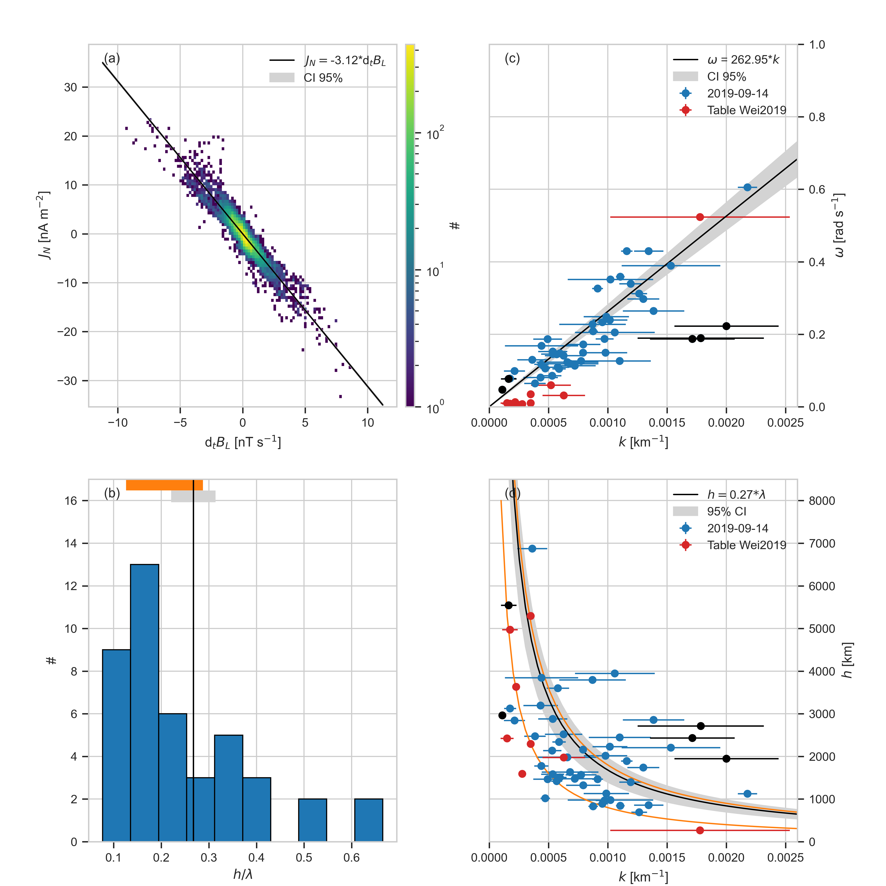

# Dispersion Relation


## Organisation
- [`dispersion-relation.py`](./dispersion-relation.py) contains the code to load data, compute the phase speed and the wavelength to thickness scaling and reproduce the Figure 6
 . The data rates, levels and figure parameters are stored in the [`./config/dispersion-relation.yml`](./config/dispersion-relation.yml
 ) file.
 
- The results of the timing method ([Vogt et al. 2011](https://angeo.copernicus.org/articles/29/2239/2011/)) are stored in [20190914_timing.h5](../data/timing/20190914_timing.h5).

- The results of other studies summarized in ([Wei et al. 2019](https://iopscience.iop.org/article/10.3847/2041-8213/ab0f28)) are stored in [table_wei2019
.h5](../data/timing/table_wei2019.h5)
 

## Datasets used
- The magnetic field measured by the Flux Gate Magnetometer (FGM) ([Russell et al. 2014](https://link.springer.com/article/10.1007/s11214-014-0057-3))
 
|             |   Data rate   | level |
|-------------|:-------------:|------:|
| $`B`$ (GSE) | srvy          | l2    |

> **_NOTE:_**  An offset in $`B_z`$ (GSE) is removed. The offset are computed between ['2019-09-14T09:17:24.000', '2019-09-14T09:18:22.000']. The offsets are stored in [bz_offsets.csv
>](../data/bz_offsets.csv).


> **_NOTE:_** The spintone is removed from the bulk velocity


## Reproducibility
```bash
python3.8 dispersion-relation.py -v --config ./config/dispersion-relation.yml
```

[](../figures/figure_6.png)