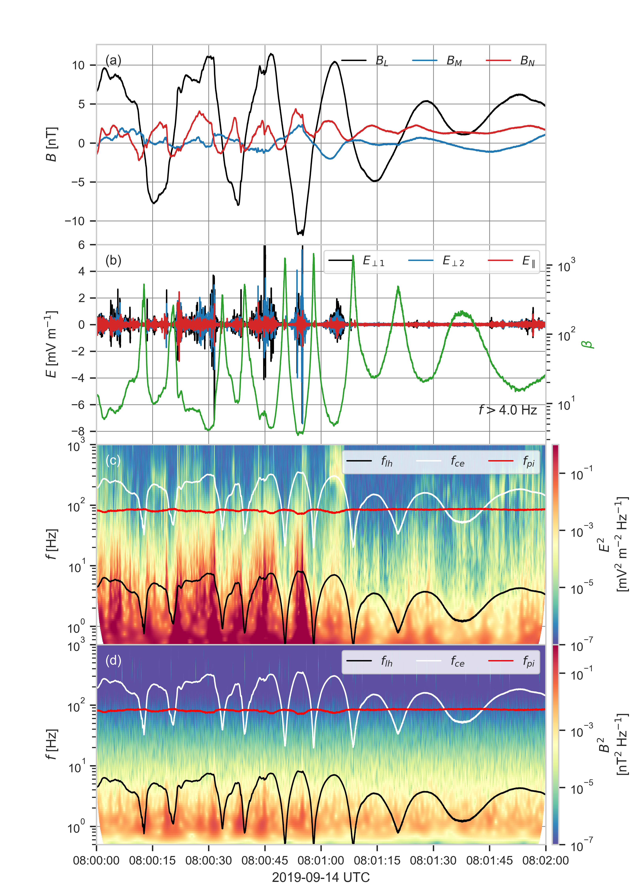

# Lower Hybrid Waves

## Organisation
- [`lh-waves.py`](./lh-waves.py) contains the code to load data, compute the
 wavelet transform of the electric field and magnetic field fluctuations and reproduce the
  Figure7. The data rates, levels and figure parameters are stored in the [`./config/lh-waves.yml`](./config/lh-waves.yml) file.   


## Datasets used
- The magnetic field measured by the Flux Gate Magnetometer (FGM) ([Russell et al. 2014](https://link.springer.com/article/10.1007/s11214-014-0057-3))
 
|             |   Data rate   | level |
|-------------|:-------------:|------:|
| $`B`$ (GSE) | srvy          | l2    |

> **_NOTE:_**  An offset in $`B_z`$ (GSE) is removed. The offset are computed between ['2019-09-14T09:17:24.000', '2019-09-14T09:18:22.000']. The offsets are stored in [bz_offsets.csv](../data/bz_offsets.csv).

- The magnetic field fluctuations measured by the Search Coil Magnetometer (SCM) ([Le Contel et
 al. 2014](https://link.springer.com/article/10.1007/s11214-014-0096-9))
 
|                    |   Data rate   | level |
|--------------------|:-------------:|------:|
| $`\delta B`$ (GSE) | brst          | l2    |

- The electric field measured by the Electric field Double Probe (EDP) ([Lindqvist et al. 2014](https://link.springer.com/article/10.1007/s11214-014-0116-9))
 
|             |   Data rate   | level |
|-------------|:-------------:|------:|
| $`E`$ (GSE) | brst          | l2    |

- The ion and electron moments are computed using the partial moments of the velocity
 distribution functions measured by the Fast Plasma Investigation (FPI) ([Pollock et al. 2016](https://link.springer.com/article/10.1007/s11214-016-0245-4)) removing the background low
 -energy noise for ions and photoelectrons.

|                |   Data rate   | level | Split Energy Level |
|:---------------|:-------------:|:------|-------------------:|
| $`P_i`$ (GSE)  | brst          | l2    |        19          |
| $`P_e`$ (GSE)  | brst          | l2    |         7          |


> **_NOTE:_** The spintone is removed from the bulk velocity

## Reproducibility
```bash
python3.8 lh-waves.py -v --config ./config/lh-waves.yml --mms-id 1
```

[](../figures/figure_7.png)