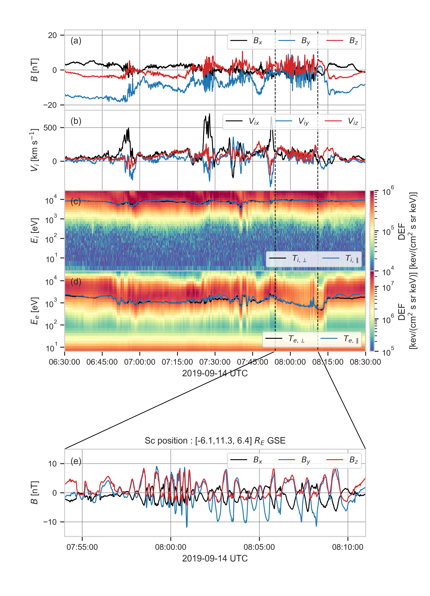

# Overview

## Organisation
- [`overview.py`](./overview.py) contains the code to load data and reproduce the Figure 1. The data
 rates, levels
 and figure parameters are stored in the [`./config/overview.yml`](/config/overview.yml) file.   


## Datasets used
- The magnetic field measured by the Flux Gate Magnetometer (FGM) ([Russell et al. 2014](https://link.springer.com/article/10.1007/s11214-014-0057-3))
 
|           |   Data rate   | level |
|-----------|:-------------:|------:|
| $`B`$ (GSE)   | srvy          | l2    |

> **_NOTE:_**  An offset in $`B_z`$ (GSE) is removed. The offset are computed between ['2019-09
>-14T09:17:24.000', '2019-09-14T09:18:22.000']. The offsets are stored in [bz_offsets.csv
>](../data/bz_offsets.csv).

- The ion and electron moments are computed using the partial moments of the velocity
 distribution functions measured by the Fast
 Plasma
 Investigation (FPI) ([Pollock et al. 2016](https://link.springer.com/article/10.1007/s11214-016-0245-4)) removing the background low-energy noise for ions and photoelectrons.

|              |   Data rate   | level | Split Energy Level |
|--------------|:-------------:|:------|-------------------:|
| $`V_i`$ (GSE)    | fast          | l2    |        19          |
| $`T_i\perp`$     | fast          | l2    |        19          |
| $`T_i\parallel`$ | fast          | l2    |        19          |
| $`V_e`$ (GSE)    | fast          | l2    |         7          |
| $`T_e\perp`$     | fast          | l2    |         7          |
| $`T_e\parallel`$ | fast          | l2    |         7          |

> **_NOTE:_** The spintone in removed from the bulk velocity

- The omnidirectional ion and electron energy spectrum are measured by the Fast Plasma Investigation
 (FPI) ([Pollock et al. 2016](https://link.springer.com/article/10.1007/s11214-016-0245-4)).

|              |   Data rate   | level |
|--------------|:-------------:|------:|
| ion DEF      | fast          | l2    |
| electron DEF | fast          | l2    |

## Reproducibility
```bash
python3.8 overview.py -v --config ./config/overview.yml
```

[](../figures/figure_1.png)

